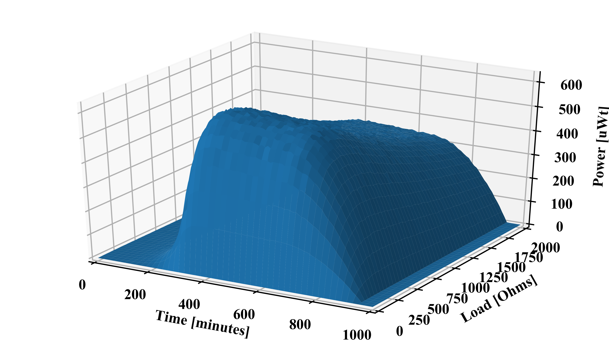
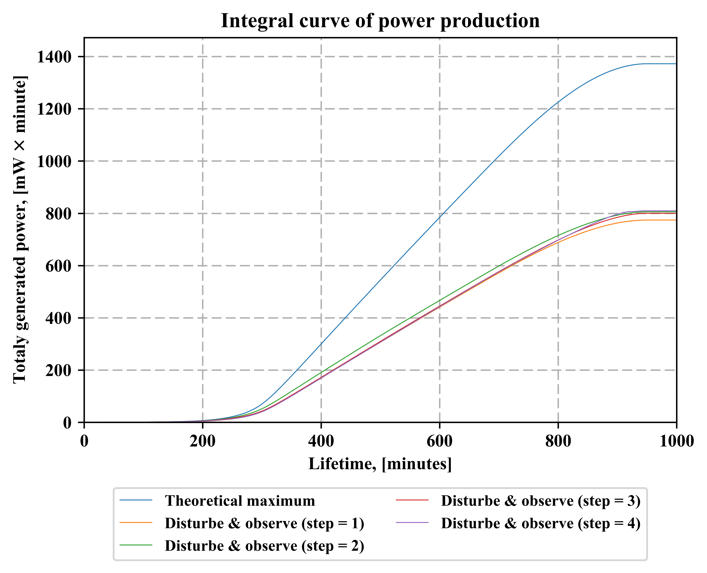
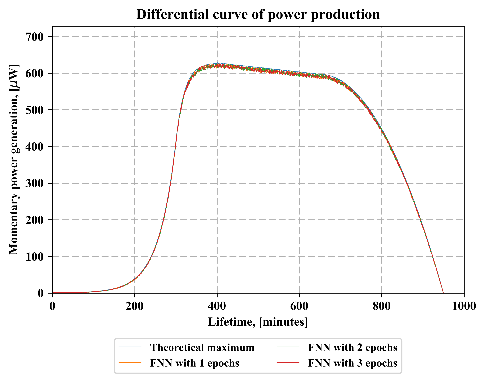
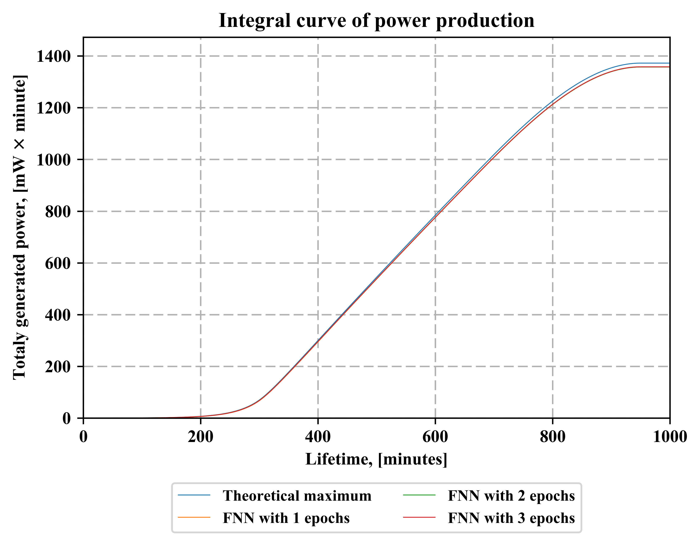
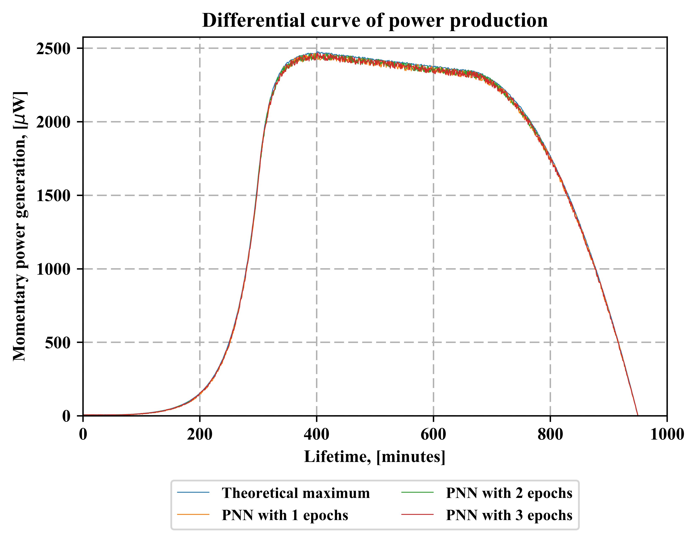
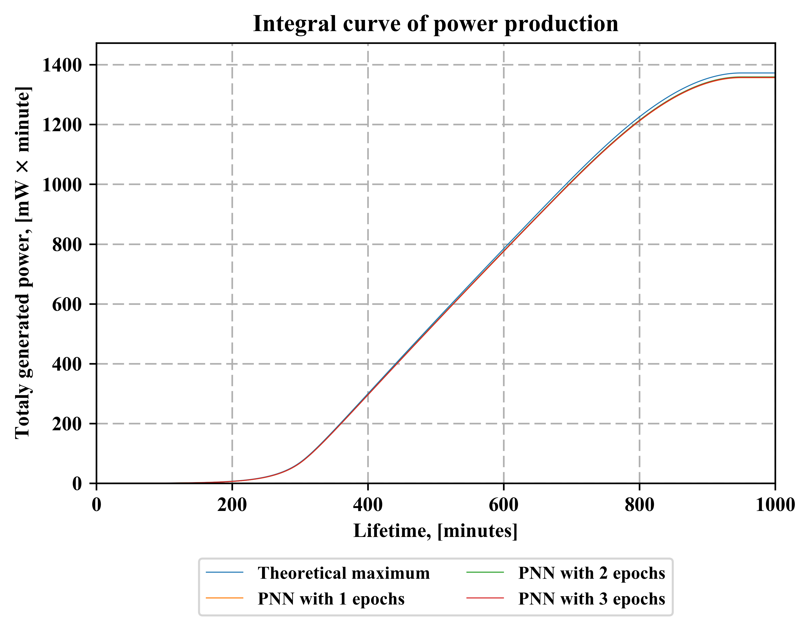

# AI Supported Maximum PowerPoint Tracking in Microbial Fuel Cell
Final Project in CS6980: Advanced Intelligent System in Clean Energy
Spring 2017

# Abstract
Project addresses challenge of extracting maximum power from microbial fuel cells (MFCs). AI-based approach, that involves use of Convolutional Neural Network (CNN), was developed and compared with standard technique called “Disturb & Observe” (D&O).
Main purpose of project is to see if AI can be a tool to improve the MMPT.

# Introduction
Microbial Fuel Cell is an Bio-Electro-Chemical device that utilize exo-electrogenic abilities of certain bacteria strains in order to:
- Produce the electricity in external circuit
- Simultaneous removal of organics / pollutants

<b>Fig. 1.</b> Typical and generalized construction of microbial fuel cell

# Problem Description
Power generation by MFCs isn’t constant and depends on wide range of operating conditions. Maximum Power Point Tracking (MPPT) is general name of techniques used for finding and keeping conditions where MFC generates maximum of possible power. Most approaches suggest to vary the applied resistance and measure voltage drop and gained current.
Project tries to develop system that would be able to predict the optimal load in next time moment depending on operating condition at current moment.

# Materials and methods

## Input Data Modelling
Input data were created as model of MFC operation with assumptions:
- MFC works in batch mode
- Voltage over time generation is proportional to microbial growth kinetics
- Voltage drops as function of applied resistance is based on semi-saturation equilibrium (1/5 of maximal load)
 Model simulates data that can be collected with method of fixed resistors or digital potentiometer. Data was saved as csv-file and consisted of 4 fields:
- Operation time
- Applied resistance
- Achieved voltage
- Generated Power

Several simulations were created with varied voltage noise levels

## Modeled data

Built models are represented as 3D-surfaces were gained power is represented as function of two variables: time and applied resistance. Several models were built with varied added noise (to add some randomness).

<b>Fig. 2.</b> Power, harvested from MFC as function of time and applied resistance (load). 5 mV noise level applied with load varied from 1 to 500 Ohms and step of 1 Ohm.

Extra observation: 
Decreasing of load ranges increases the difference in D&O behaviour, but almost doen't change the harvested energy.

# Model treatment
Input data were treated in 3 different ways and compared with theoretical maximal energy yield.
For each option differential (specific power prodiction power curve) and integral power (total produced power to some moment) curves were build.  

## Disturb and Observe
Principle of method is constant changing of applied load and measuring of changes in power production. 

<b>Fig. 3.</b> Differential power curve, reached with Disturbe and observe method

<b>Fig. 4.</b> Integral power curve, reached with Disturbe and observe method

## Following Neurel Network
This NN tries to follow the maximum power point. At each step FNN calculates the optimal load at current time and sets calculated value as load for next step. Start point is randomly selected. Compared different amount of training epochs.

<b>Fig. 5.</b> Differential power curve, reached with FNN

<b>Fig. 6.</b> Integral power curve, reached with FNN

## Predictive Neurel Network
This NN tries to predict the maximum. At each step PNN calculates the optimal load for next step, depending time. Start point is randomly selected. NNs were trained applying varied epochs nuber (from 1 till 3) to train.

<b>Fig. 7.</b> Differential power curve, reached with PNN

<b>Fig. 8.</b> Integral power curve, reached with PNN

# Summary
Techniques were compared on models with varied noise level and losses of energy were estimated by comparing with theoretical maximum. 
NNs were trained applying varied epochs amount (from 1 till 3) to train. D&O observe method implementation involves varied size of load changes (steps) expressed as multiplier of minimum change.
Tables represents total power losses in % for the whole operation lifetime:

# Conclusions
Neural Networks are shown to be more reliable approach to manage MMPT of MFC that cause higher energy recovery comparing to D&O. 
Increasing of noise decrease accuracy of prediction but it is still higher, than D&O. Comparing of FNN and PNN robustness to noise doesn’t show advantages between any of them.

# Software used:
OS: Windows 10 [x64] 
Language: Python 3.6.1 
Packages used:
- Matplotlib 2 - visualisation and plotting
- Keras - neural network implementation (with TensorFlow and NumPy as dependencies)
- Jupyter - for visualisation/programming in browser 
 If  you have problem with installing packages, find and binaries for Python in Windows at http://www.lfd.uci.edu/~gohlke/pythonlibs/  
Find instructions for packages installing via pip at https://packaging.python.org/installing/  
